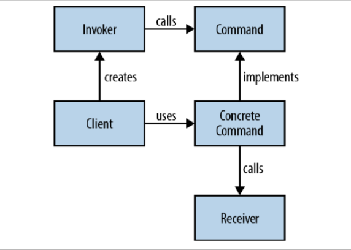

* Command pattern allows us to decouple requestor of an action from the receiver the action. A command object encapsulates 
a request to do something on a specific object. The requestor uses command objects by standard interface without knowing
how each command object internally performs action on the receiver.

* Components:
    * Client: The client instantiates the command object and provides the information required to call the method at a later time.
    * Invoker: The invoker decides when the method should be called
    * Receiver: The receiver is an instance of the class that contains the method's code (the execute() method of the class).
    * Command: Encapsulates all the information required to call the receiver.
    
    
* Implications:
    * The object that invokes the operation is decoupled from the object that knows how to perform the action. 
    (The "invoker" is decoupled from the "receiver".) As a result, that action can easily be changed without requiring a
    corresponding change in the invoker. That's why the pattern is commonly known as the producer-consumer pattern.
    * Command objects can be assembled into a sequence of composite commands. In fact, this is how "macro" commands are
    created in most GUI applications.
    * In some implementations of the Command Pattern there can also be a "time separation". That is, your Command object
     is considered a pre-packaged, ready to run object that can be implemented at some future time.

* Use Cases:
    * A history of requests is needed (Text editor undo, redo, macro recording)
    * Requests need to be handled at variant times or in variant orders (We keep commands queued up)
    * The invoker should be decoupled from the object handling the invocation.(ie Light should be loosely coupled from 
    the ON/OFF switch)
    * GUI: Handling actions for menu items and buttons.
    
* Target:

        public void actionPerformed(ActionEvent e)
        {
          Object o = e.getSource();
          if (o = fileNewMenuItem)
            doFileNewAction();
          else if (o = fileOpenMenuItem)
            doFileOpenAction();
          else if (o = fileOpenRecentMenuItem)
            doFileOpenRecentAction();
          else if (o = fileSaveMenuItem)
            doFileSaveAction();
          // and more ...
        }
        
        this code becomes very hard to maintain, and you'll have as many "if" statements as menu items

* Java Api: Java provides Action interface or the Java AbstractAction class to create commands

* Limitations: This pattern creates lot of Command classes. More operations leads to more command classes. 
Intelligence required of which Command to use and when leads to possible maintenance issues for the central controller.
    * This limitation can be removed using object-functional approach to get rid of command classes.

* Related Patterns:
    * Chain of Responsibility can use Command objects to represent requests as objects.
    * Command and Memento act as objects which can be passed around and invoked at a later time. In Command the object 
    represents an action (or response to a client event), while in Memento the object represents the internal state of 
    an object at a particular time.
    * A combination of Commands can be used to create macros with the Composite Design Pattern.

* Refs:
    * https://alvinalexander.com/java/java-command-design-pattern-in-java-examples/
    