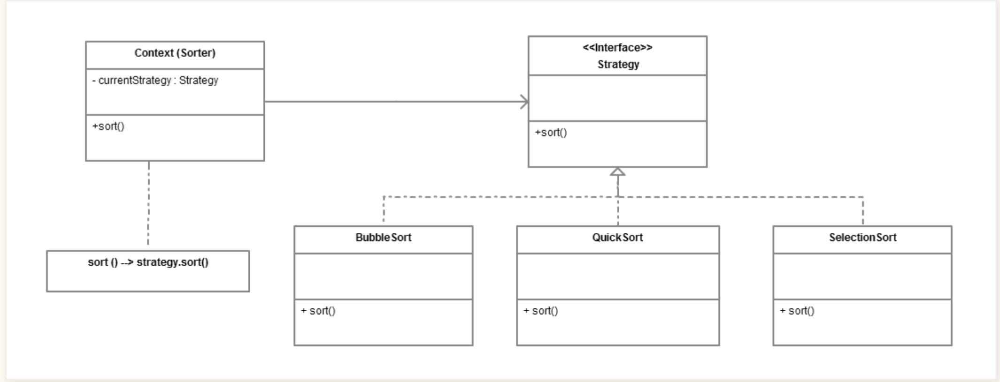

* Strategy defines a family of algorithms encapsulates each of them and make them interchangeable. 
Strategy let the algorithm vary independent of the client uses them.

* Components:
    * Strategy API/Interface: Each of our strategy algorithms will implement this interface
    * Context: Context has the strategy which it uses. Context can select it's default strategy which can also be 
    replaced at runtime.
    * Client: Creates the context with the required strategy

* Implications:
    * Clarifies algorithms by decreasing or removing conditional logic
    * Simplifies a class by moving variations on an algorithm to a hierarchy
    * Enables one algorithm to be swapped for another at runtime.

* Use Cases:
    * Saving files in different formats - Word, ODT, RTF, HTML plain text, Excel, CSV, HTML
    * Compress files using different compression algorithms
    * Plot the same data using different formats (points, line chart, bar chart, etc.)
    * Display calendars, with different holidays for different countries. (Strategy classes are USAHoliday, CanadaHoliday, etc.)
    * A store may have various pricing strategies (10% off everything, $10 off when the total exceeds $200, etc.), 
    and these strategies may be used at different times.

* Target: Replace Conditional Logic with Strategy

        public class Loan...
           public double capital() {
              if (expiry == null && maturity != null)
                 return commitment * duration() * riskFactor();
              if (expiry != null && maturity == null) {
                 if (getUnusedPercentage() != 1.0)
                    return commitment * getUnusedPercentage() * duration() * riskFactor();
                 else
                    return (outstandingRiskAmount() * duration() * riskFactor())
                        + (unusedRiskAmount() * duration() * unusedRiskFactor());
              }
              return 0.0;
           }
        
        conditional logic deals with figuring out loan type and a specific capital calculation based on that. 
        But the code doesn’t reveal its intentions well   
           
* Api Ref:
    * Java: Collection.sort(List, Comparator) method, where Comparator is Strategy and Collections.sort() is Context.

* Limitations:
    * Increased complexity for client as no of strategies increases
    * Increases no of classes which can be addressed using ofp

* Related Patterns:
    * The Strategy pattern is similar to the State Pattern, but different in their intent.
    * The Adapter Pattern is structurally similar to the Strategy Pattern, but again, the difference is intent
    * Strategy is designed for behavior, and Bridge is meant for structure although their UML diagram is same.
    * Compare to Template Method provides alternate behaviors through subclassing, while the Strategy Pattern provides 
    alternate behaviors through delegation.

* refs:
    * https://alvinalexander.com/java/java-strategy-design-pattern-in-java/