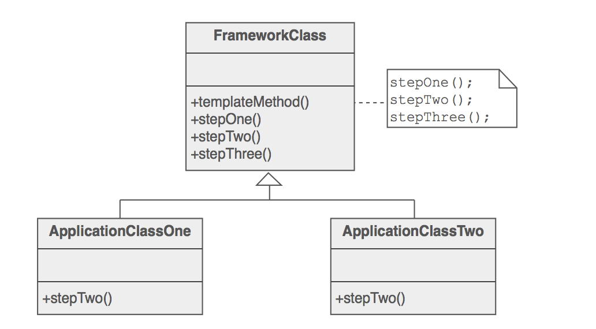

* Define the skeleton of an algorithm in an operation, deferring some steps to subclasses. Template Method pattern lets 
subclasses redefine certain steps of an algorithm without changing the algorithm's structure.

* Components: Template Method typically has four types of methods that can be used in derived classes (subclasses):
      
      . Complete methods that carry out basic functions for all child classes.
      . Methods that are not filled in at all (abstract methods in Java).
      . Methods that contain a default implementation that may be suitable for some subclasses, 
        but which may need to be overridden for other subclasses.
      . Methods that call any combination of abstract, partial, and concrete methods.

* Implications:
    * Removes duplicate code in subclass by moving invariant part to super class
    * Communicates the steps of an algorithm
    * Allows subclass to easily customize algorithm
    * Any changes in the algorithm need to be done in one place only

* Use Cases:
    * Bank giving out loans to members of the public, companies, and employees. These categories have  
    similar loan application process i.e., check the identity, credit history, and income history. 
    This information fetched from different sources and apply different criteria. 
    For example, you might check the identity of a person by looking at an existing bill to her house, 
    but companies have an official registrar such as the SEC in the US or Companies House in the UK.
    
    * Template Method is used prominently in frameworks. Each framework implements the invariant pieces of a domain's
     architecture, and defines "placeholders" for all necessary or interesting client customization options.

* Target: Two method in subclass perform similar steps in same order but steps are different

* Java Api: AbstractMap, AbstractSet

* Limitations:
    * Complication arses when subclass has to implement may abstract method.
    * Programmer need to study template method well to know which methods may be overriden.
    * You might violate the Liskov Substitution Principle by suppressing a default step implementation via a subclass.
    * since it relies on inheritance, this approach is quite invasive – it tightly couples classes together and 
    introduces with excessive boilerplate. This can be avoided by taking ofp approach.

* Related Patterns:
    * Factory Method is a specialization of Template Method. At the same time, a Factory Method may serve as a step in 
    a large Template Method.
    * We can combine strategy and template patterns to produce concrete strategy classes to avoid duplicates in
    the concrete strategy subclasses.
    * Strategy modifies the logic of individual objects. Template Method modifies the logic of an entire class.  
    * Template method pattern and Hollywood principle is connected where it's telling subclasses "don't call us, 
    we'll call you"
    
            The Hollywood Principle: Don’t call us, we’ll call you.
            a.	With this we allow lower level component to hook into the higher level component but higher level component determine when to use lower level components.
            b.	This design principle gives a technique to decouple higher and lower level components.

* refs: